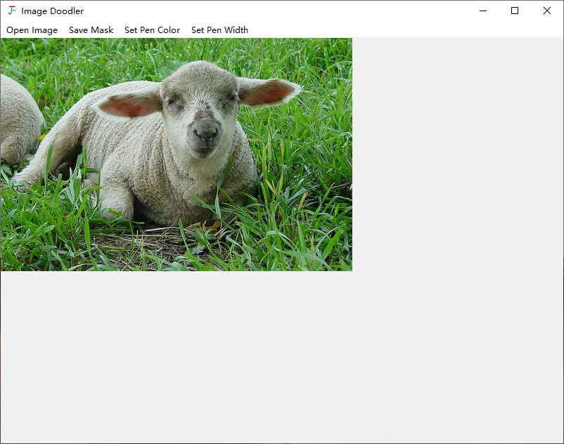
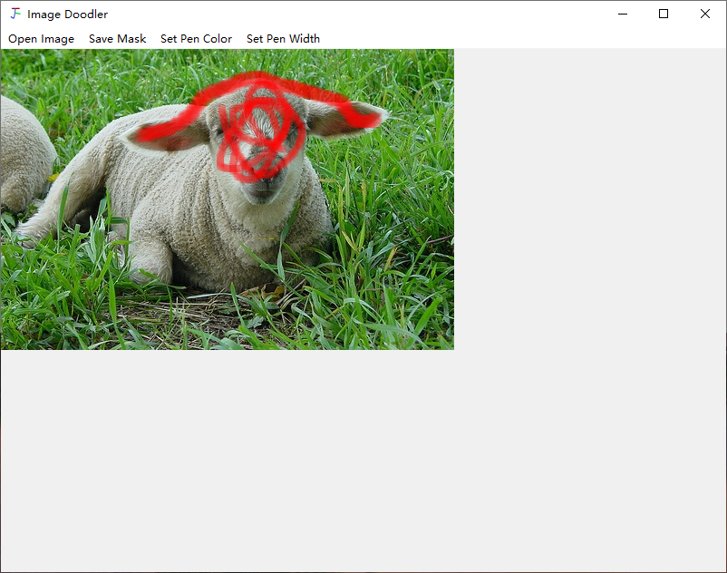
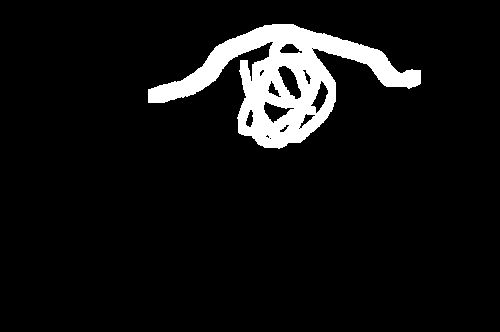

# Image-Doodler
Motivated by [BAS](https://arxiv.org/pdf/2309.12943v1), I designed this tool to generate a mask that occludes arbitrary regions (semantic features) of the image.
It can help to observe the changes in the class activation map in different masking situations.

## Download .exe
[Google drive](https://drive.google.com/file/d/1hJPo0ULw1BCam8qFI9kgRg8rKyb-rKHC/view?usp=drive_link)  

[Baidu drive](https://pan.baidu.com/s/1wu4Wy8Oqo5M-JImIJSSidg?pwd=pwvw)
## step 1: open an image

## step 2: doodle any region of the image

## step 3: save mask

